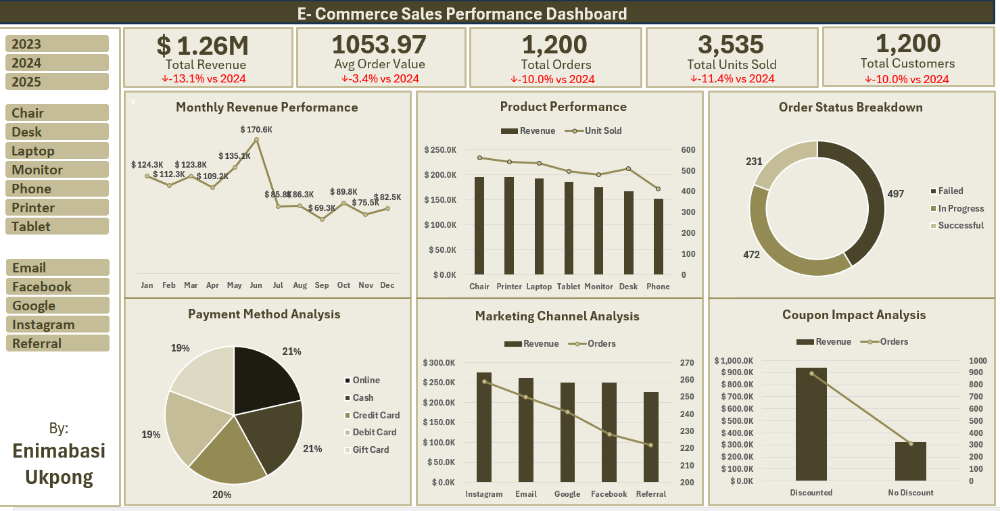

# E-Commerce Sales Analysis (Excel)

A full Exploratory Data Analysis (EDA) project 
carried out on a 1,200 row E-Commerce dataset spanning 2023, 
2024 and 2025 as part of my Data Analytics Internship at DecodeLabs.

## Table of Contents
- [Project Overview](#project-overview)
- [Dataset Description](#dataset-description)
- [Tools Used](#tools-used)
- [Excel Analysis](#excel-analysis)
- [Key Findings](#key-findings)
- [Recommendations](#recommendations)
- [Dashboard Preview](#dashboard-preview)
- [Repository Structure](#repository-structure)
- [Author](#author)

## Project Overview

This project was completed as part of a structured Data Analytics 
Internship programme at DecodeLabs. The goal was to explore, 
analyse and extract business insights from an E-Commerce dataset 
using core analyst tool — Microsoft Excel.

The project was completed in:
- **Phase 1 (Excel):** Data exploration, pivot table analysis 
  and interactive dashboard creation.

## Dataset Description

| Detail | Information |
|--------|-------------|
| **Source** | DecodeLabs Internship Dataset |
| **Rows** | 1,200 Orders |
| **Columns** | 14 |
| **Time Period** | January 2023 — June 2025 |

### Columns in the Dataset

| Column | Data Type | Description |
|--------|-----------|-------------|
| OrderID | Text | Unique order identifier |
| Date | Date | Date order was placed |
| CustomerID | Text | Unique customer identifier |
| Product | Text | Product purchased |
| Quantity | Integer | Number of units ordered |
| UnitPrice | Decimal | Price per unit |
| ShippingAddress | Text | Customer delivery address |
| PaymentMethod | Text | Method of payment used |
| OrderStatus | Text | Current status of the order |
| TrackingNumber | Text | Shipment tracking reference |
| ItemsInCart | Integer | Number of items in cart |
| CouponCode | Text | Discount coupon applied (NULL if none) |
| ReferralSource | Text | Marketing channel that brought the customer |
| TotalPrice | Decimal | Final order value |

## Tools Used

| Tool | Purpose |
|------|---------|
| Microsoft Excel | Data cleaning, pivot tables, dashboard |
| GitHub | Version control and portfolio hosting |

## Excel Analysis

### Data Preparation
The following derived columns were added to enrich the dataset 
before analysis:

- **Month, Year** — extracted from the 
  Date column for time-based trend analysis
- **Discount Flag** — categorised orders as Discounted or 
  No Discount based on CouponCode
- **Order Fulfilment** — grouped OrderStatus into Successful, 
  Failed and In Progress

### Pivot Tables Built
1. Monthly Revenue Performance
2. Product Performance
3. OrderStatus Breakdown
4. Marketing Channel Analysis
5. Payment Method Analysis
6. Coupon and Discount Impact Analysis

### Dashboard Features
- 5 KPI cards showing Total Revenue, Average Order Value, 
  Total Orders, Total Units Sold and Total Customers
- 6 interactive charts covering revenue trends, product 
  performance, fulfilment health, payment methods, 
  marketing channels and coupon impact
- Year slicer connected to all pivot tables for dynamic 
  filtering across 2023, 2024 and 2025
- Product type slicer for cross-filtering all charts 
  simultaneously

## Key Findings

1. **Monthly Trend:** June and May are consistently the best 
   performing months, with H1 outperforming H2 every year. 
   In 2023, H1 generated $359K versus $193K in H2.

2. **Referral Sources:** Instagram, Email and Google are the 
   top three revenue channels across all three years, while 
   Facebook and Referral consistently underperform.

3. **Product Performance:** Chair is the only product 
   consistently in the top three across all years. Printer 
   declined after 2023 while Desk emerged as a rising product 
   in 2025.

4. **Payment Methods:** Customer preference shifted from Cash 
   dominating in 2023 to Online payments leading in both 
   2024 and 2025.

5. **Fulfilment Health:** Failed orders outnumbered successful 
   orders in all three years. The business successfully 
   fulfilled less than 1 in 5 orders, a critical operational 
   issue requiring urgent attention.

6. **Discount Impact:** Discounted sales accounted for 74-75% 
   of total revenue every single year, making coupon-driven 
   purchases the single biggest revenue driver.

## Recommendations

1. Launch targeted H2 marketing campaigns to close the 
   consistent revenue gap between the first and second 
   half of the year.

2. Continue investment in Instagram, Email and Google while 
   conducting a review of Facebook and Referral 
   channel performance.

3. Prioritise Chair and Tablet stocking, investigate 
   declining Printer demand and monitor Desk as an 
   emerging top performer.

4. Improve the Online payment experience and survey customers 
   on friction points with Gift Card and Debit Card payments.

5. Urgently investigate whether the order failure 
   rate stems from packaging, quality control or logistics 
   failures before increasing customer acquisition spend.

6. Scale coupon-driven promotions but conduct a per-coupon 
   margin analysis to ensure discounts are growing profit 
   and not just growing volume.

## Dashboard Preview



> Built in Microsoft Excel with dynamic slicers, 
> KPI cards and 6 interactive charts.

## Repository Structure

```
ecommerce-analysis/
│
├── data/
│   └── ecommerce_dataset.csv
│
├── excel/
│   └── ecommerce_analysis.xlsx
│
├── images/
│   └── dashboard_screenshot.png
│
└── README.md
```

## Author

**Enimabasi Ukpong**
Data Analytics Intern — DecodeLabs

Connect with me:
- LinkedIn: www.linkedin.com/in/enimabasi-ukpong-98ba5822b
- Twitter/X: https://x.com/enimabasi
